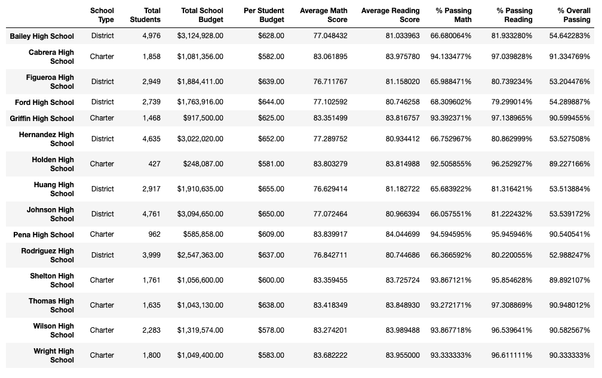
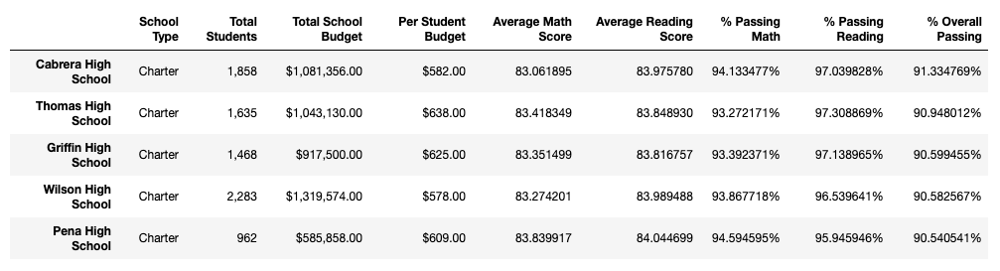
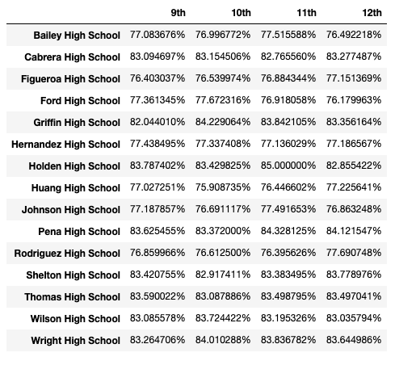
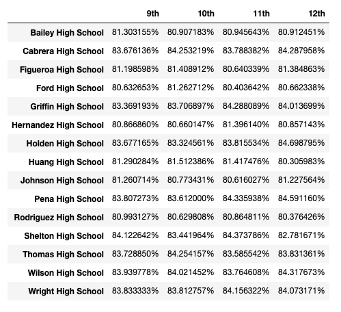

# pandas-challenge: Pandas, Pandas, Pandas

## Background

The ask was to complete one out of two Data Challenges. I chose to go with the **Option 2: PyCitySchools** challenge as my professional career has been in education administration. 

The challenge has been completed as below:

* The script was coded using the pandas library and Jupyter notebook. 

* All files are inside the folder named for the challenge `PyCitySchools`. This folder contains:

    * A Jupyter notebook called `PyCityschools.ipynb` to run the analysis.

    * A `Resources` folder that contains the CSV files `schools_complete.csv` and `students_complete.csv`. These files contain details on all students, their math and reading scores, as well as various information on the schools they attend. Our responsibility was to aggregate the data and to showcase obvious trends in school performance. Numbers were formatted as per the example solution provided, to 6 decimal places.

    * An `Analysis` folder that contains a Word document with my analysis, the same as the 'Analysis' section below.

## Analysis

After completing the script and displaying the dataframes (screenshots below), I have observed the following trends based on the data:

* Reading scores appear to be better across the board as compared to Math scores, with the total percentage of students passing reading shown to be at 85.81% while 74.98% pass Math, and only 65.17% pass both.

* The highest performing school, Cabrera High School, has a relatively lower per student spend of $582. This is lower than the per student spend of all the bottom 5 performing schools that have a budget of $637 or higher. This shows that a higher budget does not necessarily translate to better performance.

* District schools show significantly lower performance than Charter schools, as displayed in the **Scores by School Type** and **Bottom Performing Schools (By % Overall Passing)** dataframes. This is especially seen in the Math scores, where only 66.55% of students appear to be passing Math in District schools, compared to the 93.62% of Charter school students. It is also worth noting that all 5 bottom performing schools are District schools, while all 5 top performing schools are Charter schools.

## Screenshots

### District Summary

* Create a high level snapshot (in table form) of the district's key metrics, including:
  * Total Schools
  * Total Students
  * Total Budget
  * Average Math Score
  * Average Reading Score
  * % Passing Math (The percentage of students that passed math.)
  * % Passing Reading (The percentage of students that passed reading.)
  * % Overall Passing (The percentage of students that passed math **and** reading.)

  

### School Summary

* Create an overview table that summarizes key metrics about each school, including:
  * School Name
  * School Type
  * Total Students
  * Total School Budget
  * Per Student Budget
  * Average Math Score
  * Average Reading Score
  * % Passing Math (The percentage of students that passed math.)
  * % Passing Reading (The percentage of students that passed reading.)
  * % Overall Passing (The percentage of students that passed math **and** reading.)

  

### Top Performing Schools (By % Overall Passing)

* Create a table that highlights the top 5 performing schools based on % Overall Passing. Include:
  * School Name
  * School Type
  * Total Students
  * Total School Budget
  * Per Student Budget
  * Average Math Score
  * Average Reading Score
  * % Passing Math (The percentage of students that passed math.)
  * % Passing Reading (The percentage of students that passed reading.)
  * % Overall Passing (The percentage of students that passed math **and** reading.)

  

### Bottom Performing Schools (By % Overall Passing)

* Create a table that highlights the bottom 5 performing schools based on % Overall Passing. Include all of the same metrics as above.

  

### Math Scores by Grade\*\*

* Create a table that lists the average Math Score for students of each grade level (9th, 10th, 11th, 12th) at each school.

  

### Reading Scores by Grade

* Create a table that lists the average Reading Score for students of each grade level (9th, 10th, 11th, 12th) at each school.

  

### Scores by School Spending

* Create a table that breaks down school performances based on average Spending Ranges (Per Student). Use 4 reasonable bins to group school spending. Include in the table each of the following:
  * Average Math Score
  * Average Reading Score
  * % Passing Math (The percentage of students that passed math.)
  * % Passing Reading (The percentage of students that passed reading.)
  * % Overall Passing (The percentage of students that passed math **and** reading.)

    

### Scores by School Size

* Repeat the above breakdown, but this time group schools based on a reasonable approximation of school size (Small, Medium, Large).

    

### Scores by School Type

* Repeat the above breakdown, but this time group schools based on school type (Charter vs. District).

    
